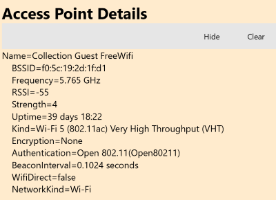
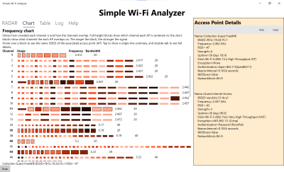
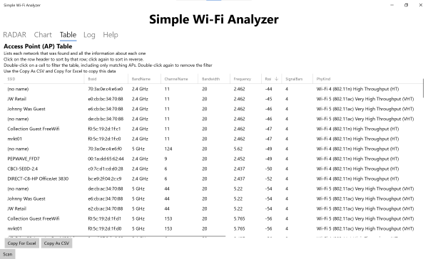
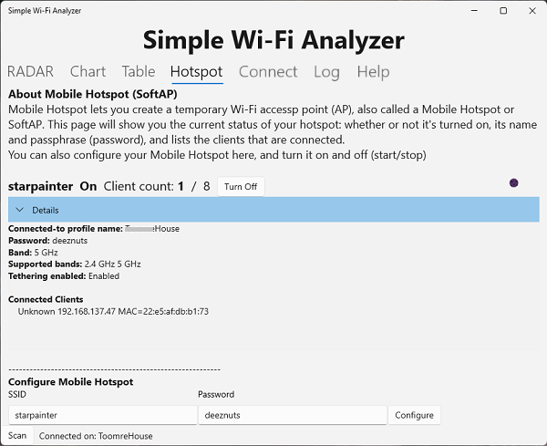
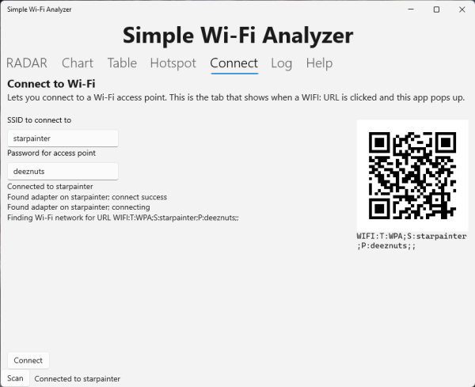



# Lexicon and helpful links

* All the app [Versions](Versions.md).
* Full Wi-Fi [Lexicon](Lexicon.md).
* Wi-Fi on [Wikipedia](https://en.wikipedia.org/wiki/Wi-Fi)

# Quick help

The Simple Wi-Fi Analyzer provides basic information about the Wi-Fi environment you are in. It provides a graphical RADAR-like display of the Wi-Fi access points in range, shows a frequency breakdown of the access points, and provides a table-like like of the details of each access point.


The sample display shows the results of a scan at a nearby shopping mall. Access points that are shown closer to the center have a strongs signal; ones further away have a weaker signal. Names in **bold** have an SSID which matches the SSID of the current Internet connection (in this case, it's called Collection Guest). In the sample, there are multiple access points advertising the same SSID.

Click on an access point to show details about the access point.

Click on the other tabs (Chart, Table, Hotspot, Connect, Log, and Help) to show the data in different formats.

# All the tabs
## RADAR

Radar provides a quick display for every access point seen in a scan. Click on an accesss point to show more details in the "Access Point Details" pane. Detailed information includes the name, the "MAC address" (BSSID), frequency and more.



## Chart (Frequency Chart)



The Frequency chart shows a list of every Wi-Fi channel in all of the bands which is used. Each access point will be displayed as a rectangle; if it's full height, the access point is broadcasting on that frequency. If the rectangle is half-height, then the access point is broadcasting on a nearby frequency which overlaps the channel.

Hover over a rectangle to show the associated SSID. Click once to show details on the bottom line and double-click to show the access point details in the details pane.

## Table


The table display shows you a table with full details about each access point. Each row is  single access point; the columns show detailed information about each access point.

Double-click on any cell and the table will be filtered to show just access points that match that value. For example, if you click on a frequency, you'll see just the access points directly on that frequency. Double-click again to stop filtering.

Click on a column header to sort by that column; click again to sort in reverse order.

Click on **Copy for Excel** to copy the data to the clipboard in a format that Excel will access. (It's an HTML table).

Click on **Copy as CSV** top copy the data to the clipboard as a CSV table.

## Hotspot


The mobile hotspot display shows the current Mobile Hotspot (otherwise known as a SoftAP) configuration. 

The first row shows the hotspot name, whether it's on or off, the number of clients currently connected, and a button to turn the hotspot on or off. 

In the Details expander you can see the profile name (the Wi-Fi connection that the internet is connected on), the password for the hotspot, and the band information for the hotspot. 

The list of connected clients will show the "host name" for each connected client (often the IP address and can also include the computer's name), plus the client MAC address. This is sometimes useful for debugging connections.

The information will refresh every few seconds. When it does, the little astronomical image at the far-right of the top line of information will update.

You can also **configure** the hotspot with a name and password. Simply enter a name and password (otherwise known as a passphrase) and press "Configure"

Some PC administrators will block the hotspot. This is set in the registry with the **NC_ShowSharedAccessUi** key. When it has a value of 0, you will be blocked from starting a hotspot. When this happens, you will see this in the Hotspot mini-log:

```
Starting mobile hotspot    Tether: Unknown     Complete
```

### Registry commands for examining and changing NC_ShowSharedAccessUi
```
reg query "HKLM\SOFTWARE\Policies\Microsoft\Windows\Network Connections"

reg add "HKLM\SOFTWARE\Policies\Microsoft\Windows\Network Connections" /v NC_ShowSharedAccessUi /t REG_DWORD /d 1
```
You can also use the RegEdit command to update the registry.

## Connect


The connect display lets you connect to a Wi-Fi network or hotspot. It will provide a WIFI: style QR code and URL to the network and provides some simple logging.

The Simple Wi-Fi Analyzer will act as a handler for the WIFI: and WIFISETUP: URL schemes. The Connect tab is the one that pops up when you use a WIFI: URL or scan a WIFI: QR Code.

## Log

The Log tab shows a text listing of every access point and the associated details along with detailed information about the Wi-Fi network adapters and the current connected network. It's sometimes useful when debugging a complex network problem.


