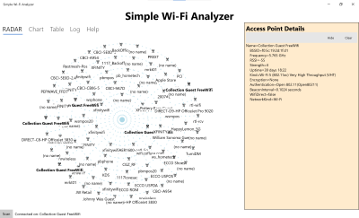

# Main help

The Simple Wi-Fi Analyzer provides basic information about the Wi-Fi environment you are in. It provides a graphical RADAR-like display of the Wi-Fi access points in range, shows a frequency breakdown of the access points, and provides a table-like like of the details of each access point.

The sample display shows the results of a scan at a nearby shopping mall. Access points that are shown closer to the center have a strongs signal; ones further away have a weaker signal. Names in **bold** have an SSID which matches the SSID of the current Internet connection (in this case, it's called Collection Guest). In the sample, there are multiple access points advertising the same SSID.

Click on an access point to show details about the access point.

Click on the other tabs (Chart, Table, Log, and Help) to show the data in different formats.

# All the tabs
## RADAR

Radar provides a quick display for every access point seen in a scan. Click on an accesss point to show more details in the "Access Point Details" pane. Detailed information includes the name, the "MAC address" (BSSID), frequency and more.

## Chart (Frequency Chart)

The Frequency chart shows a list of every Wi-Fi channel in all of the bands which is used. Each access point will be displayed as a rectangle; if it's full height, the access point is broadcasting on that frequency. If the rectangle is half-height, then the access point is broadcasting on a nearby frequency which overlaps the channel.

Hover over a rectangle to show the associated SSID. Click once to show details on the bottom line and double-click to show the access point details in the details pane.

## Table

The table display shows you a table with full details about each access point. Each row is  single access point; the columns show detailed information about each access point.

Double-click on any cell and the table will be filtered to show just access points that match that value. For example, if you click on a frequency, you'll see just the access points directly on that frequency. Double-click again to stop filtering.

Click on a column header to sort by that column; click again to sort in reverse order.

Click on **Copy for Excel** to copy the data to the clipboard in a format that Excel will access. (It's an HTML table).

Click on **Copy as CSV** top copy the data to the clipboard as a CSV table.
## Log

The Log tab shows a text listing of every access point and the associated details along with detailed information about the Wi-Fi network adapters and the current connected network. It's sometimes useful when debugging a complex network problem.

# Lexicon and helpful links

* Full Wi-Fi [Lexicon](Lexicon.md).
* Wi-Fi on [Wikipedia](https://en.wikipedia.org/wiki/Wi-Fi)
